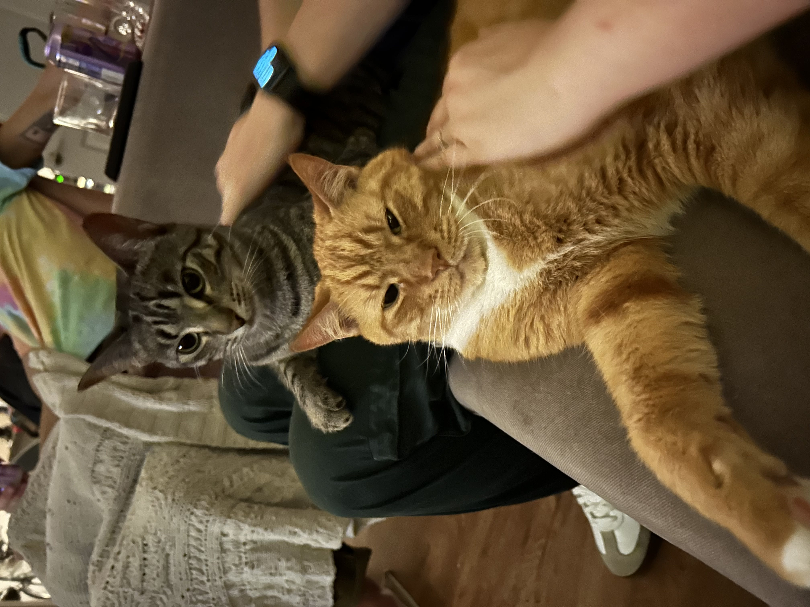

# Python-Experiment

This repository contains the initial code I've created and my journey with Github as I take DSCI 8133, *Foundations of Applied Data Science* at Mississippi State University. I'm excited for my journey towards a long and meaningful career as a Data Scientist!

---

## Plan

Future plans for this repository include adding a sample data file and a [Jupyter](https://jupyter.org/) notebook that will interact with said data file.

## About Me

My name is Jackson Baker and I work in the Information Technology industry currently. I graduated undergraduate from the **University of Mississippi** and am excited to study data science for my Masters here at MSU!

My Data Science competencies include:
- Managing Projects through Github
- Computer Vision, Natural Language Processing, and Machine Learning
- Intermediate Python, SQL, and R programming experience
- Data gathering, wrangling, and analysis for business and academic insights

In order to test the inclusion of a picture, I've provided an adorable picture of my friend's cats:

